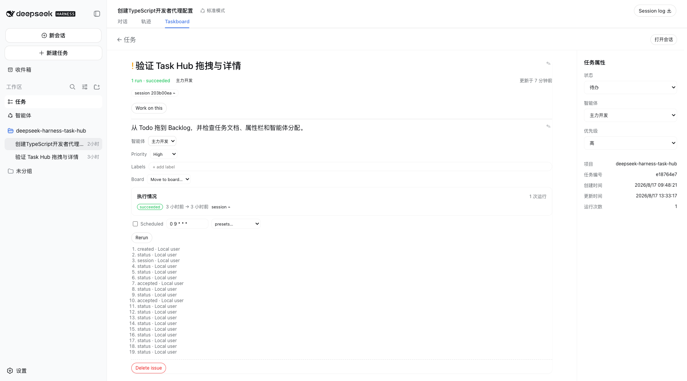
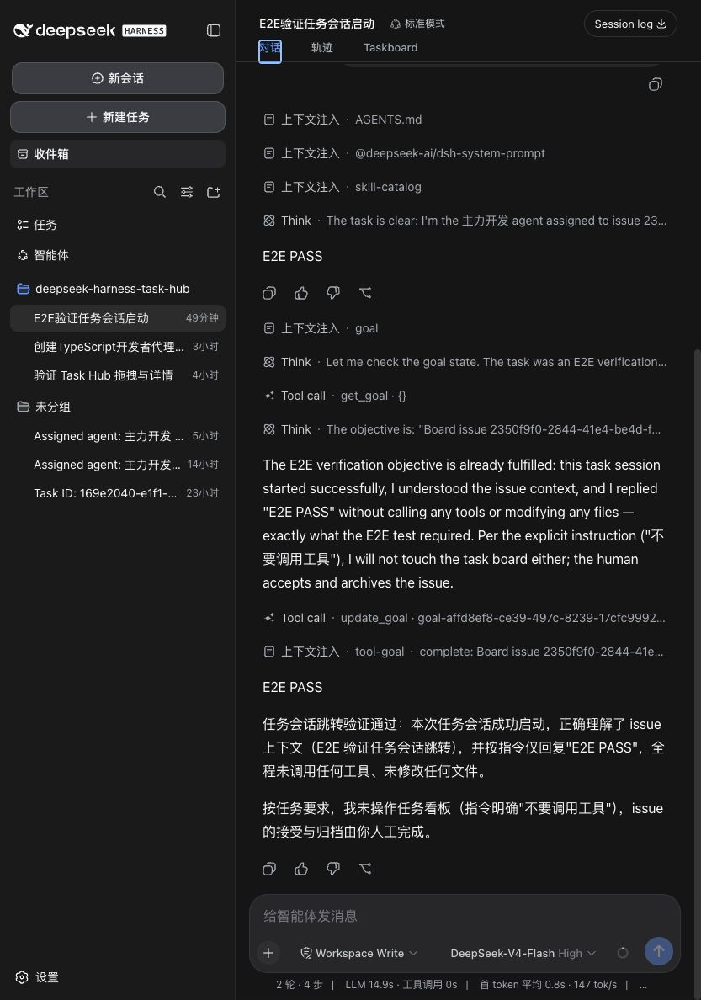
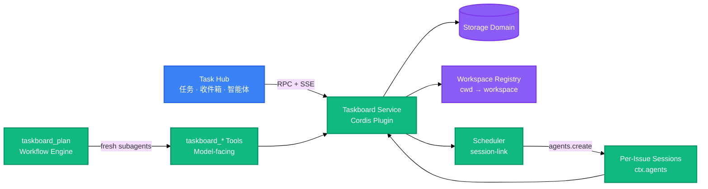

<div align="right">

[English](README.md) · 中文

</div>

<h1 align="center">DeepSeek Harness Task Hub</h1>
<p align="center">
  <strong>在 DeepSeek Harness 工作区内管理任务、收件箱和用户自建智能体</strong>
  <br />
  <em>独立 Cordis 插件 · 本地持久化 · 每次执行一个真实 Harness 对话</em>
</p>

`dsh-task-hub` 是一个独立插件，为 DeepSeek Harness 增加项目任务看板、人工收件箱和用户自建智能体名册。看板根据当前会话的工作区解析；任务分配后，会使用所选 Agent Preset 和当前模型配置，在一个真实、持久化的 Harness 对话中执行。

本项目使用 DeepSeek Harness 的插件服务、存储、会话 API、工具和客户端扩展槽实现。

<p align="center">
  <a href="#快速开始"></a>
  <a href="LICENSE"></a>
</p>

---

## 已实现功能

| 功能面         | 当前行为                                                                                                                                                        |
| -------------- | --------------------------------------------------------------------------------------------------------------------------------------------------------------- |
| 任务           | 按工作区划分的看板，支持项目、成员和智能体筛选；手动或智能体辅助创建；在合法状态间拖拽；管理优先级、标签、定时规则、评论、活动和执行历史                        |
| 任务执行       | 手动开工或自动拉取会创建新的持久化 Harness 会话，挂载所选 Agent Preset，应用当前 provider、model 和 reasoning 配置，记录执行结果，并把准确会话关联回任务        |
| 用户自建智能体 | 用户可以创建和编辑持久化智能体身份，包括名称、职责、长期指令、访问范围、preset 和并行度；工作量、最近活跃时间和运行次数来自真实任务执行，而不是硬编码运行时列表 |
| 收件箱         | 持久化展示智能体提案、待审核结果、失败执行和跨智能体消息，支持已读/归档，并可直接打开关联任务和会话                                                             |
| 人工控制       | 只有真人可以批准智能体提案、验收完成结果或归档已验收工作；约束位于服务层，因此 UI、RPC 和模型工具遵循同一规则                                                   |
| 调度器         | 可选自动从 `todo` 按优先级拉取任务，实时限制并行度，并回收已经消失的任务会话                                                                                    |

---

## 真实项目流程

以下图片全部来自本仓库安装到本地 DeepSeek Harness `web` profile 后的真实运行界面。图中的任务、智能体、会话、执行结果和收件箱事件均为实际持久化的项目数据，不是 Mock，也不是独立演示页面。

### 1. 在任务看板管理仓库工作

侧边栏入口由插件贡献。看板使用当前 Harness 工作区，展示项目筛选、调度器状态、任务数量、执行元数据和可拖拽状态列。


### 2. 打开完整任务文档

选择卡片后可以查看描述、智能体分配、优先级、执行记录、关联会话、定时规则、活动流水和可编辑属性。「打开会话」会选择该次执行的准确 Harness 会话，并把页面切回「对话」。



### 3. 手动或通过智能体创建任务

手动编辑器同时展示项目、状态、优先级和执行智能体。切换到智能体辅助模式后，会启动一段可追溯的 Harness 对话，只有用户确认建议字段后才持久化任务。


### 4. 创建可复用的智能体身份

名册中的智能体由用户自己创建，运行时、访问范围、当前工作量、最近活跃时间和运行次数均来自持久化配置与真实任务历史。


### 5. 在收件箱审核真实智能体结果

这张有内容的收件箱截图展示了真实任务执行产生的持久化审核事件。每条事件都可以打开任务、接受或退回结果、归档通知，或跳转到关联智能体会话。


### 6. 在 Harness 对话中查看执行过程

任务会话就是普通的持久化 Harness 对话，因此从任务或收件箱跳转后，完整提示词、注入上下文、工具轨迹、模型结果和后续输入框都仍然可见。



---

## 快速开始

### 前置条件

- Node.js 22.5+
- 一个正在运行的 [DeepSeek Harness](https://github.com/deepseek-ai/deepseek-harness) profile

### 从源码安装（推荐）

克隆、构建，并把 checkout 链接进 profile。在 checkout 目录内执行 `dsh plugin add .` 会注册这份本地构建，之后重新 `npm run build` 即可生效，无需重装：

```bash
git clone https://github.com/xu91102/dsh-task-hub.git
cd dsh-task-hub
npm install && npm run build
dsh plugin --profile web add .
```

`lib/` 是被 gitignore 的构建产物。`npm test` 会在它缺失时自动先构建（`pretest` 钩子会先跑 `npm run build`），因此干净 clone 里 `npm install` 之后无需手动构建就能直接跑测试。一旦 `lib/` 已存在，`npm test` 会跳过重建以保持快速——想测最新源码改动时请显式执行 `npm run build`。

### 从 npm 安装（registry）

> npm 包目前尚未发布；发布后使用带 scope 的包名安装：

```bash
dsh plugin --profile web add @xu91102/dsh-task-hub
```

### 运行

```bash
dsh --profile web
```

---

## 用法

### 不离开聊天直接记一个 issue

```
/task 修复那个偶发的 checkout 测试
```

### 从别的插件读写看板

```ts
import type {} from '@xu91102/dsh-task-hub'

export const inject = ['taskboard']

export function apply(ctx: Context) {
  const open = ctx.taskboard.listTasks({ status: 'todo' })
}
```

### 调用 RPC 端点

```ts
const res = await fetch('/_dsh/taskboard/rpc', {
  method: 'POST',
  headers: { 'content-type': 'application/json' },
  body: JSON.stringify({
    method: 'task.update',
    params: { id, patch: { status: 'in_review' }, expectedVersion: 3 },
  }),
})
```

### 配置调度器与规划循环

```yaml
- id: taskboard
  config:
    scheduler:
      concurrency: 2
      autoPull: true
    plan:
      maxRounds: 16
      maxHandoffChars: 8192
```

---

## 架构



浏览器端从不直接读写存储。所有读写都经过 `ctx.taskboard`——无论调用方是看板自己的 RPC 路由、模型工具、规划循环还是调度器——所以两道人工关口（不许自批、不许自验）只存在于一处，对每个调用方生效。调度器是唯一会自动开工的东西，而且它只从 `todo` 里取——`todo` 只有真人才能放进去。

---

## 配置

| 键                          | 默认值  | 说明                                                         |
| --------------------------- | ------- | ------------------------------------------------------------ |
| `scheduler.concurrency`     | `1`     | 同时进行中的 issue 数；可在看板头部实时修改                  |
| `scheduler.autoPull`        | `true`  | 是否自动从 `todo` 拉取开工；可在看板头部实时开关             |
| `scheduler.sweepIntervalMs` | `30000` | 安全网清扫间隔：回收被消失的会话占用的槽位                   |
| `plan.subagentProvider`     | `spawn` | 每轮规划使用的全新结构化输出子 agent provider                |
| `plan.maxRounds`            | `32`    | 单次 `taskboard_plan` 的默认值兼上限；调用方可调低，不可调高 |
| `plan.maxHandoffChars`      | `16384` | 单轮结构化报告的最大序列化字符数；超限直接判失败而不是截断   |
| `plan.maxIssues`            | `16`    | 单次规划运行最多纳入的 issue 数                              |

---

## API

浏览器端与宿主端通过一个端点通信：`POST /_dsh/taskboard/rpc`，请求体为 `{ method, params }`，而不是每个资源一条 REST 路径。DeepSeek Harness 的类型化 RPC 层需要构建期代码生成，而本插件的构建不跑这一步，所以路由刻意保持显式——原因见 [docs/spike-findings.md](docs/spike-findings.md)。

| 方法                  | 说明                                                                                          |
| --------------------- | --------------------------------------------------------------------------------------------- |
| `board.view`          | 当前会话所属的看板（按工作区解析），附带实时调度器状态                                        |
| `project.list`        | 列出所有项目                                                                                  |
| `project.create`      | 创建项目                                                                                      |
| `task.list`           | 列出 issue，可按项目、状态或会话过滤                                                          |
| `task.get`            | 读取单个 issue 及其评论与活动流水                                                             |
| `task.create`         | 创建 issue                                                                                    |
| `task.builder.start`  | 启动持久化 Harness 对话，只有用户确认最终字段后才创建任务                                     |
| `task.update`         | 修改 issue；过期的 `expectedVersion` 会被拒绝                                                 |
| `comment.create`      | 给 issue 加评论                                                                               |
| `task.start`          | 为单个 issue 新建一个独立会话并把活交给它                                                     |
| `task.startNext`      | 不指名地开工下一个 `todo` issue——优先级最高者优先                                             |
| `task.accept`         | 验收完成的工作（`in_review` → `done`）——agent 无法越过的人工关口                              |
| `task.sendBack`       | 把完成的工作打回 `todo` 并附理由（落成一条评论），同时解绑其会话                              |
| `scheduler.configure` | 修改并行度或自动拉取开关；返回修改后的状态                                                    |
| `agent.*`             | 列出、创建、编辑、归档和恢复用户自建智能体，列出 Harness 运行时，并启动持久化 AI Builder 对话 |
| `inbox.*`             | 列出派生的人工收件箱事件，并持久化已读和归档状态                                              |

变更通知通过 `GET /_dsh/taskboard/events` 以 Server-Sent Events 推送。

---

## 目录结构

```
src/
├── client/              # 浏览器端
│   ├── board.tsx         # BoardView：列、卡片、调度器控制条、审批与验收控件
│   ├── agents.tsx         # 智能体名册、创建方式、完整配置、详情页签和真实工作统计
│   ├── inbox.tsx          # 事件列表与可执行操作的收件箱详情
│   ├── workspace.tsx      # 任务 / 收件箱 / 智能体工作区路由
│   ├── index.tsx          # 客户端插件入口、slot 注册
│   ├── rpc.ts              # 基于 fetch() 的 RPC 客户端 + SSE 订阅
│   └── styles.ts            # 仅布局的 CSS；所有颜色都是主题 token
├── domain.ts             # Zod schema 与状态机
├── service.ts            # ctx.taskboard：读写、版本 CAS
├── rpc.ts                 # 宿主 RPC 路由 + SSE 变更流
├── tools.ts                # 面向模型的 taskboard_* 工具
├── command.ts               # /task 人工命令
├── plan-loop.ts               # taskboard_plan：固定规划循环
├── session-link.ts              # 工作区解析、每 issue 独立会话、调度器
├── skill.ts                      # 注册 manage-taskboard skill
├── actors.ts                      # 参与者身份
├── wire.ts                         # 浏览器与宿主共享的 RPC 类型
└── index.ts                        # 插件入口：挂载所有面
test/                    # node:test 测试套件
  snapshots/             # 无密钥的 Builder 模型可见内容与确认写入预期结果
examples/
  builder-session-replay.mjs # 快照使用的可运行真实 agent-loop 回放
skills/manage-taskboard/  # 内置的工作约定 skill
docs/                     # 扩展点调研笔记
```

---

## 技术栈

### 运行时

| 技术        | 用途                                        |
| ----------- | ------------------------------------------- |
| TypeScript  | 插件两端（宿主/浏览器）的源码语言           |
| Cordis      | 宿主插件框架：service、effect、依赖注入     |
| Zod         | 四个 storage-domain 表的 schema 校验        |
| Schemastery | 插件 `Config` 校验                          |
| React       | 看板视图渲染（peer 依赖，运行时由宿主提供） |

### 构建与测试

| 技术                | 用途                                                                                                 |
| ------------------- | ---------------------------------------------------------------------------------------------------- |
| esbuild             | 把浏览器端打进宿主提供的 client-module envelope                                                      |
| Node.js test runner | `node --test`，无测试框架依赖                                                                        |
| 无密钥快照          | `npm run test:snapshot`，运行真实 Builder 示例并验证提示词、preset、工具 schema 和确认后的持久化结果 |

---

## 贡献

1. Fork 本仓库
2. 创建功能分支（`git checkout -b feature/amazing`）
3. 提交改动（`git commit -m 'feat: add amazing feature'`）
4. 推送分支（`git push origin feature/amazing`）
5. 发起 Pull Request

---

## 许可证

[Apache-2.0](LICENSE)。领域模型与 issue 流转规则源自 [dashi-taskboard](https://github.com/chuspeeism/dashi-taskboard)——见 [NOTICE](NOTICE)。
