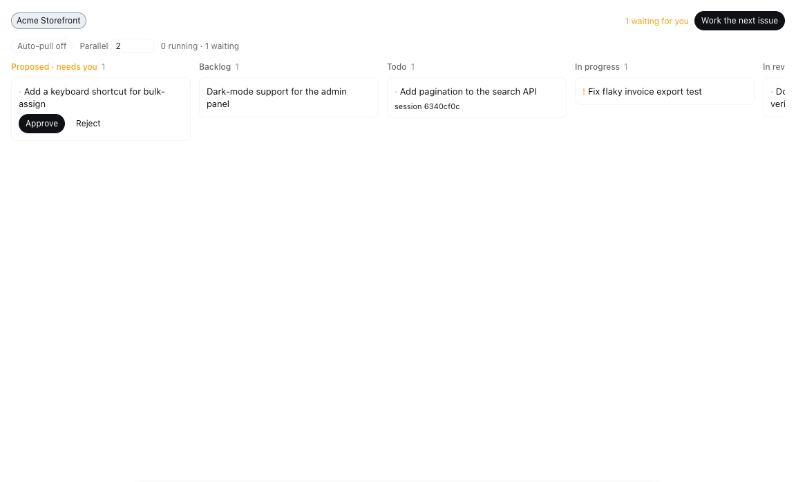
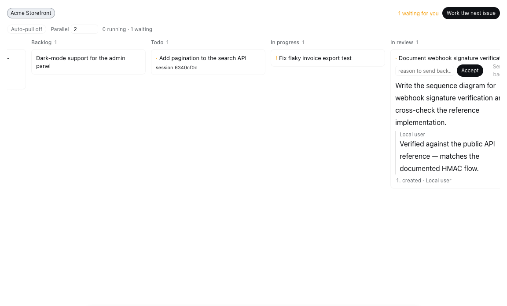
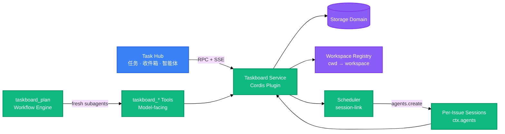

<div align="right">

[English](README.md) · 中文

</div>

<!-- AUTO-GENERATED -->

<h1 align="center">dsh-task-hub</h1>
<p align="center">
  <strong>DeepSeek Harness 的本地优先 issue 编排插件：每个仓库一块看板、每个 issue 一个独立会话、调度器自己从待办里捞活干</strong>
  <br />
  <em>Cordis 插件 · 按工作区划分看板 · 每 issue 独立会话 · 自动拉取调度器 · 两道人工审批关口</em>
</p>

任务工作区、收件箱和用户自建智能体的交互模型参考了 [Multica](https://github.com/multica-ai/multica)。本插件是独立的 DeepSeek Harness 实现，不嵌入 Multica 源码。

<p align="center">
  <a href="#quick-start"></a>
  <a href="LICENSE"></a>
</p>

<p align="center">
  
  
  
  
  
  
</p>

---

## 功能特性

| 特性                    | 说明                                                                                                                                                                                       |
| ----------------------- | ------------------------------------------------------------------------------------------------------------------------------------------------------------------------------------------ |
| 每个仓库一块看板        | 看板绑定会话的工作目录而不是对话本身：同一仓库的两个会话共享一块板，另一个仓库的会话看到自己的板——归属由宿主解析，浏览器端永远不会把不同项目的 issue 混在一起                              |
| 每个 issue 一个独立会话 | 「Work on this」会为这个 issue 新建一个独立会话并把 brief 交给它，issue 与它绑定，每个 issue 的对话记录和成本都各自独立——也因此可以多个同时跑                                              |
| 自动拉取调度器          | 调度器维持最多 N 个进行中的 issue，并自行从 `todo` 按优先级补位；并行度和自动拉取开关在看板头部实时可调                                                                                    |
| 三道人工关口            | agent 永远不能把 issue 移出 `proposed`、把自己标成 `done` 或归档工作：提案需要你批准，完成的工作需要你验收，归档也由你决定——都在服务层强制，不是 UI 上的约定                               |
| 持久化审批队列          | agent 提出的 issue 落在 `proposed` 列，等真人批准或拒绝——跨重启持久保存，不像一次性审批弹窗那样会丢                                                                                        |
| 看板是聊天的平级页签    | 看板注册进 conversation view ring，作为 Chat / Trajectory 旁边的一个页签出现，而不是独立页面                                                                                               |
| Task Hub 侧边栏         | 常驻的「任务 / 收件箱 / 智能体」入口打开同一个工作区级 Hub；任务卡片可跨状态列拖拽，并以完整文档和属性栏查看                                                                               |
| 用户自建智能体          | 参考 Multica 的名册、完整创建页和详情页统一管理身份、Owner、权限、长期指令、运行时、并行度、工作量和真实执行统计；AI Builder 会启动持久化、可追溯的 Harness 对话，而不是在浏览器中伪造对话 |
| 人工收件箱              | 智能体提案、待审核结果、失败执行和跨智能体消息进入同一个可读/归档队列，可直接打开任务、审核结果或跳转执行会话                                                                              |

---

## 截图

看板使用示例数据渲染——不包含任何真实部署的项目细节。

**看板视图**：按工作区划分的看板，包含审批队列、调度器控制条（自动拉取开关、并行度、实时 running/waiting 计数），以及进行中 issue 上的会话标识：



**Issue 详情**，从卡片展开，显示统一验收控件——Accept（验收通过），或填写理由 Send back（打回，理由会落成一条评论）：



---

## 快速开始

### 前置条件

- Node.js 22.5+
- 一个正在运行的 [DeepSeek Harness](https://github.com/deepseek-ai/deepseek-harness) profile

### 从源码安装（推荐）

克隆、构建，并把 checkout 链接进 profile。在 checkout 目录内执行 `dsh plugin add .` 会注册这份本地构建，之后重新 `npm run build` 即可生效，无需重装：

```bash
git clone https://github.com/xu91102/dsh-task-hub.git
cd dsh-task-hub
npm install && npm run build
dsh plugin --profile web add .
```

`lib/` 是被 gitignore 的构建产物。`npm test` 会在它缺失时自动先构建（`pretest` 钩子会先跑 `npm run build`），因此干净 clone 里 `npm install` 之后无需手动构建就能直接跑测试。一旦 `lib/` 已存在，`npm test` 会跳过重建以保持快速——想测最新源码改动时请显式执行 `npm run build`。

### 从 npm 安装（registry）

> npm 包目前尚未发布；发布后使用带 scope 的包名安装：

```bash
dsh plugin --profile web add @xu91102/dsh-task-hub
```

### 运行

```bash
dsh --profile web
```

---

## 用法

### 不离开聊天直接记一个 issue

```
/task 修复那个偶发的 checkout 测试
```

### 从别的插件读写看板

```ts
import type {} from '@xu91102/dsh-task-hub'

export const inject = ['taskboard']

export function apply(ctx: Context) {
  const open = ctx.taskboard.listTasks({ status: 'todo' })
}
```

### 调用 RPC 端点

```ts
const res = await fetch('/_dsh/taskboard/rpc', {
  method: 'POST',
  headers: { 'content-type': 'application/json' },
  body: JSON.stringify({
    method: 'task.update',
    params: { id, patch: { status: 'in_review' }, expectedVersion: 3 },
  }),
})
```

### 配置调度器与规划循环

```yaml
- id: taskboard
  config:
    scheduler:
      concurrency: 2
      autoPull: true
    plan:
      maxRounds: 16
      maxHandoffChars: 8192
```

---

## 架构



浏览器端从不直接读写存储。所有读写都经过 `ctx.taskboard`——无论调用方是看板自己的 RPC 路由、模型工具、规划循环还是调度器——所以两道人工关口（不许自批、不许自验）只存在于一处，对每个调用方生效。调度器是唯一会自动开工的东西，而且它只从 `todo` 里取——`todo` 只有真人才能放进去。

---

## 配置

| 键                          | 默认值  | 说明                                                         |
| --------------------------- | ------- | ------------------------------------------------------------ |
| `scheduler.concurrency`     | `1`     | 同时进行中的 issue 数；可在看板头部实时修改                  |
| `scheduler.autoPull`        | `true`  | 是否自动从 `todo` 拉取开工；可在看板头部实时开关             |
| `scheduler.sweepIntervalMs` | `30000` | 安全网清扫间隔：回收被消失的会话占用的槽位                   |
| `plan.subagentProvider`     | `spawn` | 每轮规划使用的全新结构化输出子 agent provider                |
| `plan.maxRounds`            | `32`    | 单次 `taskboard_plan` 的默认值兼上限；调用方可调低，不可调高 |
| `plan.maxHandoffChars`      | `16384` | 单轮结构化报告的最大序列化字符数；超限直接判失败而不是截断   |
| `plan.maxIssues`            | `16`    | 单次规划运行最多纳入的 issue 数                              |

---

## API

浏览器端与宿主端通过一个端点通信：`POST /_dsh/taskboard/rpc`，请求体为 `{ method, params }`，而不是每个资源一条 REST 路径。DeepSeek Harness 的类型化 RPC 层需要构建期代码生成，而本插件的构建不跑这一步，所以路由刻意保持显式——原因见 [docs/spike-findings.md](docs/spike-findings.md)。

| 方法                  | 说明                                                                                          |
| --------------------- | --------------------------------------------------------------------------------------------- |
| `board.view`          | 当前会话所属的看板（按工作区解析），附带实时调度器状态                                        |
| `project.list`        | 列出所有项目                                                                                  |
| `project.create`      | 创建项目                                                                                      |
| `task.list`           | 列出 issue，可按项目、状态或会话过滤                                                          |
| `task.get`            | 读取单个 issue 及其评论与活动流水                                                             |
| `task.create`         | 创建 issue                                                                                    |
| `task.update`         | 修改 issue；过期的 `expectedVersion` 会被拒绝                                                 |
| `comment.create`      | 给 issue 加评论                                                                               |
| `task.start`          | 为单个 issue 新建一个独立会话并把活交给它                                                     |
| `task.startNext`      | 不指名地开工下一个 `todo` issue——优先级最高者优先                                             |
| `task.accept`         | 验收完成的工作（`in_review` → `done`）——agent 无法越过的人工关口                              |
| `task.sendBack`       | 把完成的工作打回 `todo` 并附理由（落成一条评论），同时解绑其会话                              |
| `scheduler.configure` | 修改并行度或自动拉取开关；返回修改后的状态                                                    |
| `agent.*`             | 列出、创建、编辑、归档和恢复用户自建智能体，列出 Harness 运行时，并启动持久化 AI Builder 对话 |
| `inbox.*`             | 列出派生的人工收件箱事件，并持久化已读和归档状态                                              |

变更通知通过 `GET /_dsh/taskboard/events` 以 Server-Sent Events 推送。

---

## 目录结构

```
src/
├── client/              # 浏览器端
│   ├── board.tsx         # BoardView：列、卡片、调度器控制条、审批与验收控件
│   ├── agents.tsx         # 智能体名册、创建方式、完整配置、详情页签和真实工作统计
│   ├── inbox.tsx          # 事件列表与可执行操作的收件箱详情
│   ├── workspace.tsx      # 任务 / 收件箱 / 智能体工作区路由
│   ├── index.tsx          # 客户端插件入口、slot 注册
│   ├── rpc.ts              # 基于 fetch() 的 RPC 客户端 + SSE 订阅
│   └── styles.ts            # 仅布局的 CSS；所有颜色都是主题 token
├── domain.ts             # Zod schema 与状态机
├── service.ts            # ctx.taskboard：读写、版本 CAS
├── rpc.ts                 # 宿主 RPC 路由 + SSE 变更流
├── tools.ts                # 面向模型的 taskboard_* 工具
├── command.ts               # /task 人工命令
├── plan-loop.ts               # taskboard_plan：固定规划循环
├── session-link.ts              # 工作区解析、每 issue 独立会话、调度器
├── skill.ts                      # 注册 manage-taskboard skill
├── actors.ts                      # 参与者身份
├── wire.ts                         # 浏览器与宿主共享的 RPC 类型
└── index.ts                        # 插件入口：挂载所有面
test/                    # node:test 测试套件
skills/manage-taskboard/  # 内置的工作约定 skill
docs/                     # 扩展点调研笔记
```

---

## 技术栈

### 运行时

| 技术        | 用途                                        |
| ----------- | ------------------------------------------- |
| TypeScript  | 插件两端（宿主/浏览器）的源码语言           |
| Cordis      | 宿主插件框架：service、effect、依赖注入     |
| Zod         | 四个 storage-domain 表的 schema 校验        |
| Schemastery | 插件 `Config` 校验                          |
| React       | 看板视图渲染（peer 依赖，运行时由宿主提供） |

### 构建与测试

| 技术                | 用途                                            |
| ------------------- | ----------------------------------------------- |
| esbuild             | 把浏览器端打进宿主提供的 client-module envelope |
| Node.js test runner | `node --test`，无测试框架依赖                   |

---

## 贡献

1. Fork 本仓库
2. 创建功能分支（`git checkout -b feature/amazing`）
3. 提交改动（`git commit -m 'feat: add amazing feature'`）
4. 推送分支（`git push origin feature/amazing`）
5. 发起 Pull Request

---

## 许可证

[Apache-2.0](LICENSE)。领域模型与 issue 流转规则源自 [dashi-taskboard](https://github.com/chuspeeism/dashi-taskboard)——见 [NOTICE](NOTICE)。
