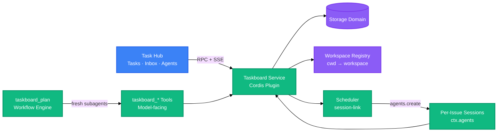

<div align="right">

English · [中文](README-zh.md)

</div>

<h1 align="center">Task Hub for DeepSeek Harness</h1>
<p align="center">
  <strong>Tasks, inbox, and user-created agents inside the DeepSeek Harness workspace</strong>
  <br />
  <em>Independent Cordis plugin · Local durable data · One Harness conversation per execution</em>
</p>

`dsh-task-hub` is an independent plugin that adds a project task board, a human inbox, and a roster of user-created agents to DeepSeek Harness. The board is resolved from the active session's workspace, and assigned work runs in a real persistent Harness conversation with the selected Agent Preset and current model configuration.

The implementation uses DeepSeek Harness plugin services, storage, session APIs, tools, and client extension slots.

<p align="center">
  <a href="#quick-start"></a>
  <a href="LICENSE"></a>
</p>

---

## What is implemented

| Surface             | Current behavior                                                                                                                                                                                                                                  |
| ------------------- | ------------------------------------------------------------------------------------------------------------------------------------------------------------------------------------------------------------------------------------------------- |
| Tasks               | Workspace-scoped Kanban board with project, member, and agent filters; manual and AI-assisted creation; valid drag-and-drop status transitions; priority, labels, schedules, comments, activity, and execution history                            |
| Task execution      | Starting or auto-pulling a task creates a fresh persistent Harness session, mounts the chosen Agent Preset, applies the active provider/model/reasoning selection, records the result, and links the exact session back to the task               |
| User-created agents | Users create and edit durable agent identities with a name, responsibility, standing instructions, access scope, preset, and concurrency. Workload, activity, and run counts come from real task executions rather than a hard-coded runtime list |
| Inbox               | Durable events for agent proposals, review-ready work, failed runs, and cross-agent messages, with read/archive state and direct actions for the related task and session                                                                         |
| Human control       | Only a human may approve an agent proposal, accept completed work, or archive accepted work. These checks live in the service, so UI, RPC, and model tools follow the same rules                                                                  |
| Scheduler           | Optional auto-pull from `todo`, highest priority first, with a live concurrency limit and recovery for vanished sessions                                                                                                                          |

---

## Real project walkthrough

Every image below was captured from this repository installed in a local DeepSeek Harness `web` profile. The tasks, agents, sessions, execution results, and inbox events shown here are actual persisted project data—not mockups or a standalone demo page.

### 1. Manage repository work on the task board

The sidebar entries are contributed by the plugin. The board uses the active Harness workspace and shows project filters, scheduler state, task counts, execution metadata, and drag-and-drop status columns.


### 2. Open the complete task document

Selecting a card opens its description, assignment, priority, execution attempts, bound session, schedule, activity trail, and editable property inspector. "Open session" selects that execution's exact Harness session and switches the conversation view back to Chat.


### 3. Create work manually or with an agent

The manual composer keeps the project, status, priority, and assignee visible. Agent-assisted mode starts a logged Harness conversation and persists the task only after the user confirms the proposed fields.


### 4. Create reusable agent identities

The agent roster contains profiles created by the user. It reports the configured runtime, access scope, active workload, last activity, and run count from durable task history.


### 5. Review real agent output in the inbox

This populated inbox shows durable review events from actual task runs. Each event can open the task, accept or return the work, archive the notification, or jump to the linked agent session.


### 6. Inspect the execution in its Harness conversation

Task sessions are ordinary persistent Harness conversations, so the complete prompt, injected context, tool trace, model result, and follow-up composer remain available after navigation from the board or inbox.


---

## Quick Start

### Prerequisites

- Node.js 22.5+
- A running [DeepSeek Harness](https://github.com/deepseek-ai/deepseek-harness) profile

### Install from source (recommended)

Clone, build, and link the checkout into the profile. `dsh plugin add .` from inside the checkout registers the local build, so later `npm run build` runs are picked up without reinstalling:

```bash
git clone https://github.com/xu91102/dsh-task-hub.git
cd dsh-task-hub
npm install && npm run build
dsh plugin --profile web add .
```

`lib/` is gitignored build output. `npm test` builds it automatically when it is missing (a `pretest` hook runs `npm run build` first), so on a fresh clone you can run tests right after `npm install` without building by hand. Once `lib/` exists, `npm test` skips the rebuild to stay fast — run `npm run build` explicitly to test your latest source changes.

### Install from npm (registry)

> The npm package has not been published yet. After publishing, install it by its scoped package name:

```bash
dsh plugin --profile web add @xu91102/dsh-task-hub
```

### Run

```bash
dsh --profile web
```

---

## Usage

### Capture an issue without leaving the chat

```
/task Fix the flaky checkout test
```

### Call the board from another plugin

```ts
import type {} from '@xu91102/dsh-task-hub'

export const inject = ['taskboard']

export function apply(ctx: Context) {
  const open = ctx.taskboard.listTasks({ status: 'todo' })
}
```

### Call the RPC endpoint

```ts
const res = await fetch('/_dsh/taskboard/rpc', {
  method: 'POST',
  headers: { 'content-type': 'application/json' },
  body: JSON.stringify({
    method: 'task.update',
    params: { id, patch: { status: 'in_review' }, expectedVersion: 3 },
  }),
})
```

### Configure the scheduler and the planning loop

```yaml
- id: taskboard
  config:
    scheduler:
      concurrency: 2
      autoPull: true
    plan:
      maxRounds: 16
      maxHandoffChars: 8192
```

---

## Architecture



The browser half never talks to storage directly. Every read and write goes through `ctx.taskboard`, whether the caller is the board's own RPC route, a model-facing tool, the planning loop, or the scheduler — so the two human gates (no self-approval, no self-acceptance) live in one place and apply to every caller. The scheduler is the only thing that starts work on its own, and it draws exclusively from `todo`, which only a human can put an issue into.

---

## Configuration

| Key                         | Default | Description                                                                                                                  |
| --------------------------- | ------- | ---------------------------------------------------------------------------------------------------------------------------- |
| `scheduler.concurrency`     | `1`     | How many issues may run at once; changeable live from the board header                                                       |
| `scheduler.autoPull`        | `true`  | Whether the board pulls from `todo` on its own; changeable live from the board header                                        |
| `scheduler.sweepIntervalMs` | `30000` | Safety-net sweep that frees slots occupied by vanished sessions                                                              |
| `plan.subagentProvider`     | `spawn` | Fresh structured-output subagent provider used for every planning round                                                      |
| `plan.maxRounds`            | `32`    | Default AND ceiling for one `taskboard_plan` run; a call may lower it, never raise it                                        |
| `plan.maxHandoffChars`      | `16384` | Maximum serialized characters in one round's structured report; an oversized report fails the run instead of being truncated |
| `plan.maxIssues`            | `16`    | Maximum issues admitted into one planning run                                                                                |

---

## API

The browser half talks to the host half over one endpoint, `POST /_dsh/taskboard/rpc`, with `{ method, params }` in the body, rather than one REST path per resource. DeepSeek Harness's typed RPC layer requires build-time code generation this plugin's build does not run, so the route is deliberately explicit — see [docs/spike-findings.md](docs/spike-findings.md) for why.

| Method                | Description                                                                                                                                |
| --------------------- | ------------------------------------------------------------------------------------------------------------------------------------------ |
| `board.view`          | The board this session belongs to (resolved from its workspace), with live scheduler state                                                 |
| `project.list`        | List every project                                                                                                                         |
| `project.create`      | Create a project                                                                                                                           |
| `task.list`           | List issues, optionally filtered by project, status, or session                                                                            |
| `task.get`            | Read one issue with its comments and activity trail                                                                                        |
| `task.create`         | Create an issue                                                                                                                            |
| `task.builder.start`  | Start a persistent Harness conversation that creates a task only after the user confirms its final fields                                  |
| `task.update`         | Change an issue; refuses a stale `expectedVersion`                                                                                         |
| `comment.create`      | Add a comment to an issue                                                                                                                  |
| `task.start`          | Open a FRESH session for one issue and hand it the work                                                                                    |
| `task.startNext`      | Start the next `todo` issue — highest priority first — without naming one                                                                  |
| `task.accept`         | Accept finished work (`in_review` → `done`) — the human gate no agent can pass                                                             |
| `task.sendBack`       | Send finished work back to `todo` with a reason (recorded as a comment), unbinding its session                                             |
| `scheduler.configure` | Change concurrency or the auto-pull toggle; returns the resulting state                                                                    |
| `agent.*`             | List, create, edit, archive, and restore user-created agents, list Harness runtime presets, and start a persistent AI Builder conversation |
| `inbox.*`             | List derived human inbox events and persist read/archive state                                                                             |

Change notifications stream over `GET /_dsh/taskboard/events` as Server-Sent Events.

---

## Directory Structure

```
src/
├── client/              # Browser half
│   ├── board.tsx         # BoardView: columns, cards, scheduler strip, approval + acceptance controls
│   ├── agents.tsx         # Agent roster, creation methods, configuration, detail tabs and real work statistics
│   ├── inbox.tsx          # Event rail and actionable inbox detail
│   ├── workspace.tsx      # Tasks / Inbox / Agents workspace router
│   ├── index.tsx          # Client plugin entry, slot registration
│   ├── rpc.ts              # fetch()-based RPC client + SSE subscription
│   └── styles.ts            # Layout-only CSS; every color is a theme token
├── domain.ts             # Zod schemas and the status machine
├── service.ts            # ctx.taskboard: reads, writes, version CAS
├── rpc.ts                 # Host RPC route + SSE change stream
├── tools.ts                # Model-facing taskboard_* tools
├── command.ts               # /task human command
├── plan-loop.ts               # taskboard_plan: the fixed planning loop
├── session-link.ts              # Workspace resolution, per-issue sessions, the scheduler
├── skill.ts                      # Registers the manage-taskboard skill
├── actors.ts                      # Actor identity
├── wire.ts                         # Shared browser <-> host RPC types
└── index.ts                        # Plugin entry: mounts every face
test/                    # node:test suites
  snapshots/             # Keyless expected model-visible Builder transcript and confirmed write
examples/
  builder-session-replay.mjs # Runnable concrete agent-loop replay used by the snapshot
skills/manage-taskboard/  # Bundled working-agreement skill
docs/                     # Extension-point research notes
```

---

## Tech Stack

### Runtime

| Technology  | Purpose                                                                 |
| ----------- | ----------------------------------------------------------------------- |
| TypeScript  | Source language for both plugin halves                                  |
| Cordis      | Host plugin framework: services, effects, dependency injection          |
| Zod         | Schema validation for the four storage-domain tables                    |
| Schemastery | Plugin `Config` validation                                              |
| React       | Board view rendering (peer dependency, supplied by the host at runtime) |

### Build & Test

| Technology          | Purpose                                                                                                                               |
| ------------------- | ------------------------------------------------------------------------------------------------------------------------------------- |
| esbuild             | Bundles the browser half into the client-module envelope the host serves                                                              |
| Node.js test runner | `node --test`, no test framework dependency                                                                                           |
| Keyless snapshot    | `npm run test:snapshot`, runs the concrete Builder example and verifies its prompt, preset, tool schema, and confirmed durable result |

---

## Contributing

1. Fork the repository
2. Create a feature branch (`git checkout -b feature/amazing`)
3. Commit your changes (`git commit -m 'feat: add amazing feature'`)
4. Push to the branch (`git push origin feature/amazing`)
5. Open a Pull Request

---

## License

[Apache-2.0](LICENSE). The domain model and issue-flow rules derive from [dashi-taskboard](https://github.com/chuspeeism/dashi-taskboard) — see [NOTICE](NOTICE).
