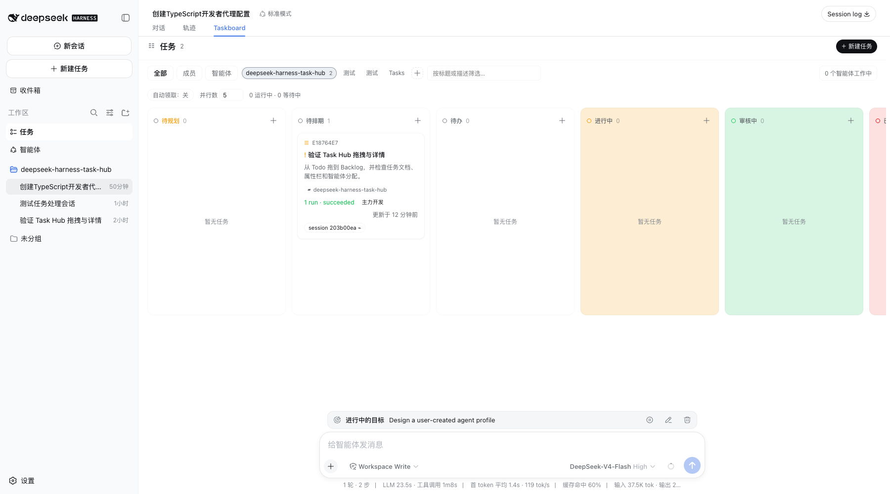
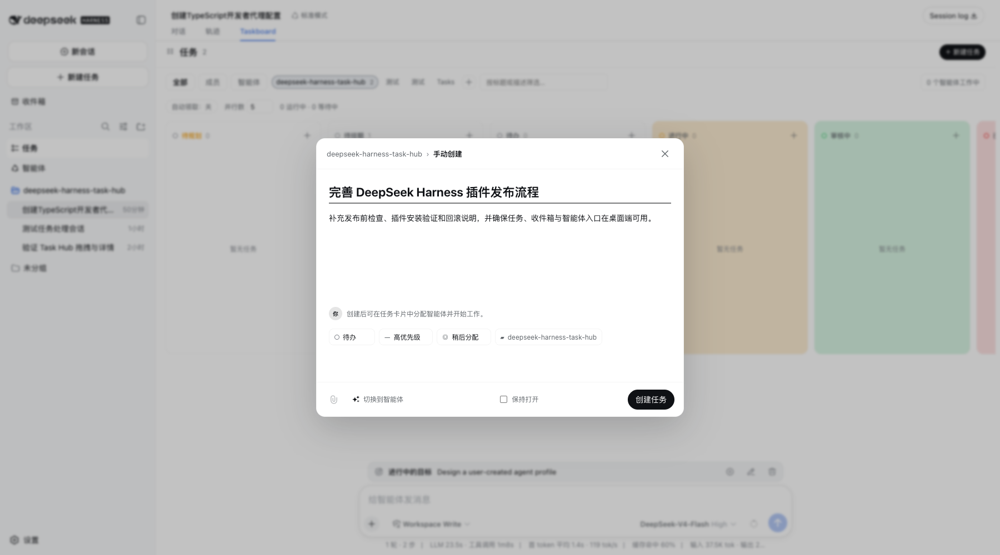
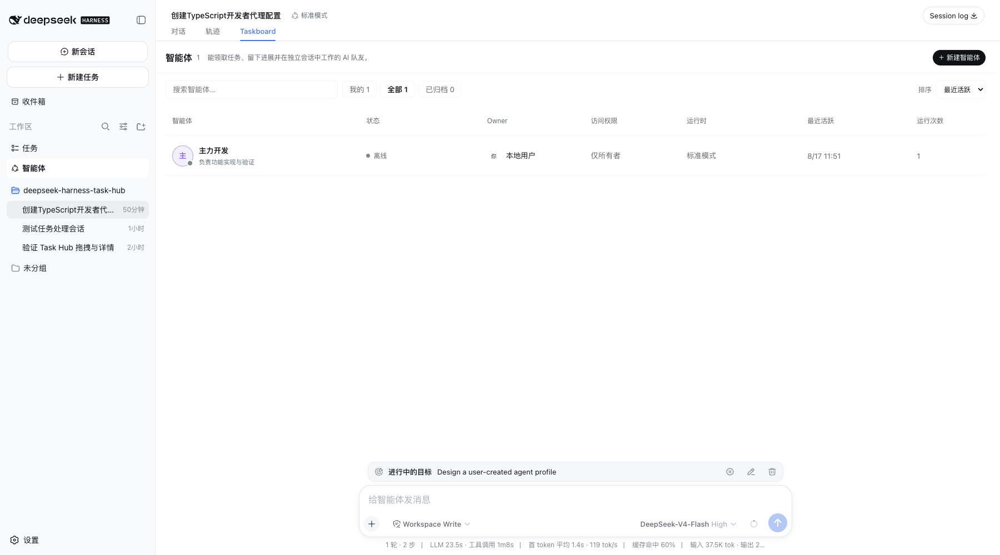
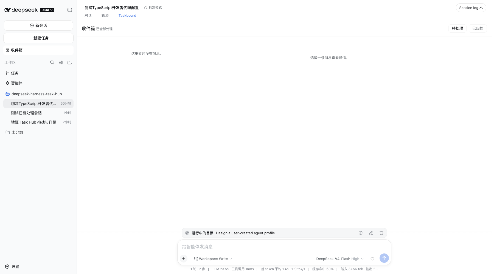
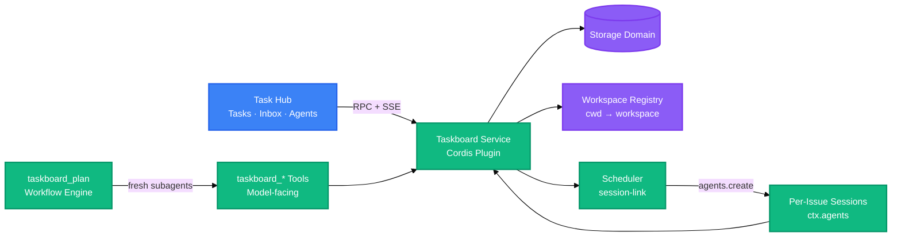

<div align="right">

English · [中文](README-zh.md)

</div>

<!-- AUTO-GENERATED -->

<h1 align="center">dsh-task-hub</h1>
<p align="center">
  <strong>Local-first issue orchestrator for DeepSeek Harness: one board per repository, a fresh session per issue, and a scheduler that works the queue itself</strong>
  <br />
  <em>Cordis Plugin · Workspace-Scoped Board · Per-Issue Sessions · Auto-Pull Scheduler · Two Human Approval Gates</em>
</p>

The task workspace, inbox, and user-created agent interaction model are inspired by [Multica](https://github.com/multica-ai/multica). This plugin is an independent DeepSeek Harness implementation and does not embed Multica source code.

<p align="center">
  <a href="#quick-start"></a>
  <a href="LICENSE"></a>
</p>

<p align="center">
  
  
  
  
  
  
</p>

---

## Features

| Feature                  | Description                                                                                                                                                                                                                                                                                                                    |
| ------------------------ | ------------------------------------------------------------------------------------------------------------------------------------------------------------------------------------------------------------------------------------------------------------------------------------------------------------------------------ |
| One Board Per Repository | The board is bound to the session's working directory, not to the conversation: two sessions in the same repo share a board, and a session in another repo sees its own — the host resolves it, so the browser can never mix projects                                                                                          |
| Fresh Session Per Issue  | "Work on this" opens a brand-new session with the issue's brief and binds the issue to it, so every issue's transcript and cost are its own — and several can run at once                                                                                                                                                      |
| Auto-Pull Scheduler      | A scheduler keeps up to N issues in flight and refills from `todo` by itself — highest priority first — with live controls for concurrency and the auto-pull toggle in the board header                                                                                                                                        |
| Three Human Gates        | An agent can never move an issue out of `proposed`, can never mark one `done`, and can never shelve one as `archieved`: proposals need your approval, finished work needs your acceptance, and archiving accepted work is yours too — all enforced in the service layer, not the UI                                            |
| Durable Approval Queue   | Agent-proposed issues land in a `proposed` column and stay there until a human approves or rejects them — durable across restarts, unlike a one-shot approval prompt                                                                                                                                                           |
| Board as a Chat Peer     | The board registers into the conversation view ring, so it appears as a tab beside Chat and Trajectory instead of a separate page                                                                                                                                                                                              |
| Task Hub Sidebar         | Persistent Tasks, Inbox, and Agents entries open one workspace-native hub; task cards drag between status columns and open as full documents with a property inspector                                                                                                                                                         |
| Multica-style Task Flow  | Full-height status columns, dense task cards, ownership scopes, and a wide task composer with manual and agent-assisted modes are adapted to Harness theme tokens                                                                                                                                                              |
| User-Created Agents      | A Multica-inspired roster and full-page creation/detail flow keeps identity, owner, access, standing instructions, runtime preset, concurrency, workload, and real execution statistics together; the AI Builder starts a persistent logged Harness conversation and saves the confirmed profile through a session-scoped tool |
| Human Inbox              | Proposals, completed work awaiting review, failed executions, and cross-agent mail arrive in one read/archive queue with task, review, and session actions                                                                                                                                                                     |

---

## Screenshots

These screenshots were captured from the plugin running in a local DeepSeek Harness `web` profile. They show the real sidebar integration, workspace data, task flow, and agent UI rather than a standalone mock page.

**Task board**: the workspace-scoped Multica-style board inside a real Harness conversation, with ownership filters, project filters, scheduler controls, status columns, execution metadata, and drag-and-drop targets:



**Create task**: the wide manual composer uses Harness theme tokens and keeps status, priority, agent assignment, and project context visible without leaving the board. Switching modes opens the real agent-assisted task flow:



**User-created agents**: persistent agent identities are listed with owner, access, runtime, recent activity, and real run counts:



**Human inbox**: proposals, review-ready work, failures, and agent messages share one readable and archivable queue:



---

## Quick Start

### Prerequisites

- Node.js 22.5+
- A running [DeepSeek Harness](https://github.com/deepseek-ai/deepseek-harness) profile

### Install from source (recommended)

Clone, build, and link the checkout into the profile. `dsh plugin add .` from inside the checkout registers the local build, so later `npm run build` runs are picked up without reinstalling:

```bash
git clone https://github.com/xu91102/dsh-task-hub.git
cd dsh-task-hub
npm install && npm run build
dsh plugin --profile web add .
```

`lib/` is gitignored build output. `npm test` builds it automatically when it is missing (a `pretest` hook runs `npm run build` first), so on a fresh clone you can run tests right after `npm install` without building by hand. Once `lib/` exists, `npm test` skips the rebuild to stay fast — run `npm run build` explicitly to test your latest source changes.

### Install from npm (registry)

> The npm package has not been published yet. After publishing, install it by its scoped package name:

```bash
dsh plugin --profile web add @xu91102/dsh-task-hub
```

### Run

```bash
dsh --profile web
```

---

## Usage

### Capture an issue without leaving the chat

```
/task Fix the flaky checkout test
```

### Call the board from another plugin

```ts
import type {} from '@xu91102/dsh-task-hub'

export const inject = ['taskboard']

export function apply(ctx: Context) {
  const open = ctx.taskboard.listTasks({ status: 'todo' })
}
```

### Call the RPC endpoint

```ts
const res = await fetch('/_dsh/taskboard/rpc', {
  method: 'POST',
  headers: { 'content-type': 'application/json' },
  body: JSON.stringify({
    method: 'task.update',
    params: { id, patch: { status: 'in_review' }, expectedVersion: 3 },
  }),
})
```

### Configure the scheduler and the planning loop

```yaml
- id: taskboard
  config:
    scheduler:
      concurrency: 2
      autoPull: true
    plan:
      maxRounds: 16
      maxHandoffChars: 8192
```

---

## Architecture



The browser half never talks to storage directly. Every read and write goes through `ctx.taskboard`, whether the caller is the board's own RPC route, a model-facing tool, the planning loop, or the scheduler — so the two human gates (no self-approval, no self-acceptance) live in one place and apply to every caller. The scheduler is the only thing that starts work on its own, and it draws exclusively from `todo`, which only a human can put an issue into.

---

## Configuration

| Key                         | Default | Description                                                                                                                  |
| --------------------------- | ------- | ---------------------------------------------------------------------------------------------------------------------------- |
| `scheduler.concurrency`     | `1`     | How many issues may run at once; changeable live from the board header                                                       |
| `scheduler.autoPull`        | `true`  | Whether the board pulls from `todo` on its own; changeable live from the board header                                        |
| `scheduler.sweepIntervalMs` | `30000` | Safety-net sweep that frees slots occupied by vanished sessions                                                              |
| `plan.subagentProvider`     | `spawn` | Fresh structured-output subagent provider used for every planning round                                                      |
| `plan.maxRounds`            | `32`    | Default AND ceiling for one `taskboard_plan` run; a call may lower it, never raise it                                        |
| `plan.maxHandoffChars`      | `16384` | Maximum serialized characters in one round's structured report; an oversized report fails the run instead of being truncated |
| `plan.maxIssues`            | `16`    | Maximum issues admitted into one planning run                                                                                |

---

## API

The browser half talks to the host half over one endpoint, `POST /_dsh/taskboard/rpc`, with `{ method, params }` in the body, rather than one REST path per resource. DeepSeek Harness's typed RPC layer requires build-time code generation this plugin's build does not run, so the route is deliberately explicit — see [docs/spike-findings.md](docs/spike-findings.md) for why.

| Method                | Description                                                                                                                                |
| --------------------- | ------------------------------------------------------------------------------------------------------------------------------------------ |
| `board.view`          | The board this session belongs to (resolved from its workspace), with live scheduler state                                                 |
| `project.list`        | List every project                                                                                                                         |
| `project.create`      | Create a project                                                                                                                           |
| `task.list`           | List issues, optionally filtered by project, status, or session                                                                            |
| `task.get`            | Read one issue with its comments and activity trail                                                                                        |
| `task.create`         | Create an issue                                                                                                                            |
| `task.builder.start`  | Start a persistent Harness conversation that creates a task only after the user confirms its final fields                                  |
| `task.update`         | Change an issue; refuses a stale `expectedVersion`                                                                                         |
| `comment.create`      | Add a comment to an issue                                                                                                                  |
| `task.start`          | Open a FRESH session for one issue and hand it the work                                                                                    |
| `task.startNext`      | Start the next `todo` issue — highest priority first — without naming one                                                                  |
| `task.accept`         | Accept finished work (`in_review` → `done`) — the human gate no agent can pass                                                             |
| `task.sendBack`       | Send finished work back to `todo` with a reason (recorded as a comment), unbinding its session                                             |
| `scheduler.configure` | Change concurrency or the auto-pull toggle; returns the resulting state                                                                    |
| `agent.*`             | List, create, edit, archive, and restore user-created agents, list Harness runtime presets, and start a persistent AI Builder conversation |
| `inbox.*`             | List derived human inbox events and persist read/archive state                                                                             |

Change notifications stream over `GET /_dsh/taskboard/events` as Server-Sent Events.

---

## Directory Structure

```
src/
├── client/              # Browser half
│   ├── board.tsx         # BoardView: columns, cards, scheduler strip, approval + acceptance controls
│   ├── agents.tsx         # Agent roster, creation methods, configuration, detail tabs and real work statistics
│   ├── inbox.tsx          # Event rail and actionable inbox detail
│   ├── workspace.tsx      # Tasks / Inbox / Agents workspace router
│   ├── index.tsx          # Client plugin entry, slot registration
│   ├── rpc.ts              # fetch()-based RPC client + SSE subscription
│   └── styles.ts            # Layout-only CSS; every color is a theme token
├── domain.ts             # Zod schemas and the status machine
├── service.ts            # ctx.taskboard: reads, writes, version CAS
├── rpc.ts                 # Host RPC route + SSE change stream
├── tools.ts                # Model-facing taskboard_* tools
├── command.ts               # /task human command
├── plan-loop.ts               # taskboard_plan: the fixed planning loop
├── session-link.ts              # Workspace resolution, per-issue sessions, the scheduler
├── skill.ts                      # Registers the manage-taskboard skill
├── actors.ts                      # Actor identity
├── wire.ts                         # Shared browser <-> host RPC types
└── index.ts                        # Plugin entry: mounts every face
test/                    # node:test suites
skills/manage-taskboard/  # Bundled working-agreement skill
docs/                     # Extension-point research notes
```

---

## Tech Stack

### Runtime

| Technology  | Purpose                                                                 |
| ----------- | ----------------------------------------------------------------------- |
| TypeScript  | Source language for both plugin halves                                  |
| Cordis      | Host plugin framework: services, effects, dependency injection          |
| Zod         | Schema validation for the four storage-domain tables                    |
| Schemastery | Plugin `Config` validation                                              |
| React       | Board view rendering (peer dependency, supplied by the host at runtime) |

### Build & Test

| Technology          | Purpose                                                                  |
| ------------------- | ------------------------------------------------------------------------ |
| esbuild             | Bundles the browser half into the client-module envelope the host serves |
| Node.js test runner | `node --test`, no test framework dependency                              |

---

## Contributing

1. Fork the repository
2. Create a feature branch (`git checkout -b feature/amazing`)
3. Commit your changes (`git commit -m 'feat: add amazing feature'`)
4. Push to the branch (`git push origin feature/amazing`)
5. Open a Pull Request

---

## License

[Apache-2.0](LICENSE). The domain model and issue-flow rules derive from [dashi-taskboard](https://github.com/chuspeeism/dashi-taskboard) — see [NOTICE](NOTICE).
